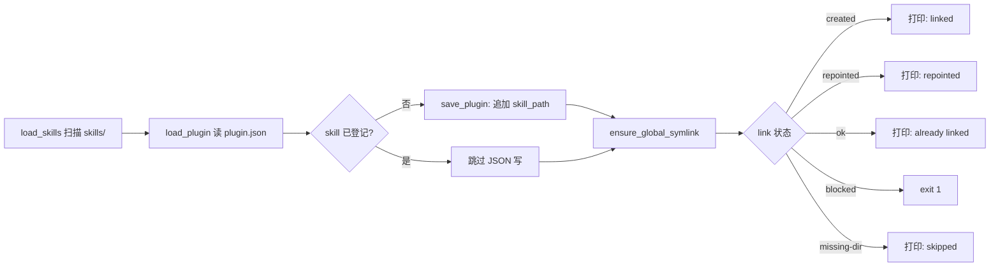

# 痛点拆解：cli.py 中 plugin.json 与 symlink 状态漂移

> 核心痛点（一句话）：在 cli.py 的 add/remove 操作中，plugin.json（清单）与 `~/.claude/skills/<name>` symlink（全局路由）状态独立维护，缺少单一 source + reconcile 机制，导致两处描述不一致（drift）时无自动发现和修复手段。
>
> 来源：对话输入（用户指出 cli.py 存在"两份独立写入"风险）｜ 拆解时间：2026-08-24

## 1. 痛点分支

- **痛点 A：plugin.json 写入失败 / 写一半**：add 走到第 129 行 `save_plugin(plugin_data)` 后断电 / IO 失败 / 进程被 kill → JSON 残留旧内容；但代码会继续走到 symlink 创建，于是出现"symlink 已建但 plugin.json 未登记"的中间态。
- **痛点 B：手动编辑 plugin.json 绕过 cli**：开发者直接 `vim .claude-plugin/plugin.json` 增删条目，下一次 `add` / `remove` 不会察觉这种"外部 mutation"，CLI 与 JSON 互相覆盖。
- **痛点 C：skill 改名或移动后 symlink 死链**：源目录 `skills/<category>/<old-name>` 重命名为 `new-name`，但 `~/.claude/skills/old-name` 仍是 symlink → 指向不存在路径 → Claude Code 路由失败但 plugin.json 仍声称存在。
- **痛点 D：plugin cache 与 plugin.json 不同步**：缓存目录 `~/.claude/plugins/cache/zack-skills/...` 是物理拷贝，`refresh --clear-cache` 才强制重拉；但日常 add/remove 后 Claude Code 路由仍然打到旧缓存（运行时未必每次重新解析）。
- **痛点 E：add 与 remove 并发竞争**：用户 A 在 add skill X，用户 B 同时 remove skill X → 两个进程都先读 plugin.json，各自写回 → 后写者覆盖前者的变更，丢失一边的意图。
- **痛点 F：缺少 drift 自检命令**：当前没有 `status` / `verify` / `reconcile` 子命令，用户只能肉眼对比 plugin.json 内容与 `ls -la ~/.claude/skills/`，无机器可读的状态报告。

## 2. 词性拆解

### 2.1 名词（Entities）

| 实体 | 含义 | 角色 | 状态 |
|------|------|------|------|
| `plugin.json` | 项目根 `.claude-plugin/plugin.json` 中的 skill 清单 | 主体（项目内 source of truth 之一） | 持久 |
| `global symlink` | `~/.claude/skills/<name>` 软链接到本地 skill 目录 | 主体（运行时路由载体） | 持久 |
| `plugin cache` | `~/.claude/plugins/cache/zack-skills/zack-skills/<ver>/skills/` 物理拷贝 | 主体（Marketplace 安装后的副本） | 持久 |
| `source skill dir` | 本地 `skills/<category>/<name>/SKILL.md` | 客体（被指代的真实内容） | 持久 |
| `drift event` | 三方状态（plugin.json / symlink / cache）中任意两者不一致 | 主体（待检测的现象） | 临时 |
| `cli.py` | 维护这三方一致性的工具脚本 | 主体（修复者 / 引入者） | 持久 |

> 实体筛选：保留 6 个核心 entity。`marketplace.json`、`package.json`、`plugins/zack/` 是构建产物，不属于运行时三方态，留给 `/planning` 处理。

### 2.2 动词（Actions）

| 动作 | 触发 | 终结状态 | 时序 |
|------|------|----------|------|
| `add(skill)` | 用户主动（`python3 cli.py add <name>`） | plugin.json 含条目 ∧ global symlink 存在 | #1 |
| `remove(skill)` | 用户主动 | plugin.json 不含条目 ∧ symlink 不存在 | #2 |
| `load_plugin()` | 每次 cli 启动 | 读取 plugin.json 到内存 dict | #3 |
| `save_plugin(data)` | add/remove/init/all 写盘后 | 写回 plugin.json | #4 |
| `ensure_global_symlink(name, target)` | add/bulk-sync 后调用 | symlink 存在且指向 target | #5 |
| `remove_global_symlink(name)` | remove 后调用 | symlink 被删除 | #6 |
| `refresh(--clear-cache / --sync-global)` | 用户主动 | 重新对齐 cache 与 symlink | #7 |
| `reconcile()` | （缺失）应自动检测三方不一致 | 输出 drift 报告并尝试修复 | #8（缺失） |
| `audit_log(op, result)` | （缺失）记录每次 mutation | 留下可追溯的 op 历史 | #9（缺失） |

### 2.3 形容词 / 副词（Rules）

| 限定词 | 含义 | 限定对象 |
|--------|------|----------|
| **"独立维护"** | plugin.json 与 symlink 走两条独立路径 | add/remove |
| **"非原子"** | 写 JSON 后才建 symlink，两步无 rollback | save_plugin → ensure_global_symlink |
| **"无 reconcile"** | 没有自检命令 | drift event |
| **"并发不安全"** | read-modify-write 无锁 | add / remove |
| **"覆盖式"** | `save_plugin` 直接整文件重写 | plugin.json 文件 |
| **"单向"** | add 成功但 symlink 失败时，plugin.json 不回滚 | add 流程 |
| **"可选"** | `--clear-cache` 与 `--sync-global` 是 flag，不强制 | refresh |
| **"一次性"** | cli.py 进程结束后无守护进程 | drift 持续 |

## 3. 名词衍生：核心指标 & 数据结构

### 3.1 核心指标

| 指标 | 计算方式 | 业务意义 | 度量频率 |
|------|----------|----------|----------|
| **DriftEventCount** | `reconcile()` 报告的不一致条目数 | 衡量三方一致性的健康度 | 每次 reconcile |
| **SymlinkDeadRate** | `dead_symlinks / total_symlinks`（realpath 不存在 / 非项目目录） | 反映改名/删除遗留的死链 | 每次 reconcile |
| **AddAtomicityRate** | `add_fully_succeeded / add_total`（两步都成功才算） | 衡量 add 的事务完整性 | CI / 每日 |
| **CacheStaleness** | `cache_mtime < source_mtime` 的 skill 数 | 反映 plugin cache 与源不同步的程度 | 每次 refresh |
| **ConcurrentAddConflict** | 同一分钟 add 同一 skill 的次数 - 1 | 检测 read-modify-write 竞争 | CI / 每周 |
| **JsonWriteFailureRate** | `save_plugin 抛异常次数 / 总 save 次数` | 写盘失败率 | 每次 save |
| **ManualEditDeltaCount** | `git diff .claude-plugin/plugin.json` 与 `make regenerate` 产物的差异行数 | 衡量 CLI 之外的人工 mutation | 每次 CI |

> 反向检验：每条指标若翻倍 / 减半，"运维或开发者第一反应是什么？"
> - DriftEventCount 翻倍 → 用户报"skill 装不上"或"指令找不到" → 应触发 reconcile → 高价值。
> - CacheStaleness 上升 → 用户跑 `/plugin install` 还是老版本 → 触发 `--clear-cache` → 中价值。
> - ConcurrentAddConflict 大概率是 0，但若 > 0 说明真有竞争 → 必修。

### 3.2 数据结构

```yaml
# 运行时三方状态的最小可信表示
SkillState:
  name: string                    # frontmatter name
  category_path: string           # 例如 engineering/pain-decomposition
  in_plugin_json: bool            # .claude-plugin/plugin.json 是否有 ./skills/<category_path>
  in_symlink: bool                # ~/.claude/skills/<name> 是否存在
  symlink_target: ref(string)     # 软链接指向的绝对路径
  symlink_target_alive: bool      # target 是否仍存在
  in_cache: bool                  # ~/.claude/plugins/cache/.../skills/<category_path> 是否存在
  last_source_mtime: timestamp    # SKILL.md 本地修改时间
  last_cache_mtime: timestamp     # 缓存中 SKILL.md 修改时间

# 一次不一致事件
DriftEvent:
  skill_name: ref(string)
  drift_type: enum                # missing-in-json | missing-in-symlink | dead-symlink | stale-cache | json-only | symlink-only | cache-only
  severity: enum                  # critical | high | medium | low
  detected_at: timestamp
  auto_repairable: bool
  suggested_fix: string           # 人类可读的修复命令

# cli 每次 mutation 的不可变审计
CliOpAudit:
  op: enum                        # add | remove | init | refresh
  skill_name: string
  before_json: list[string]
  after_json: list[string]
  before_symlink_exists: bool
  after_symlink_exists: bool
  success: bool
  error: string | null
  started_at: timestamp
  finished_at: timestamp
  pid: int
  hostname: string
```

> 实体备注：`SkillState` 持久但不需要落盘，每次 reconcile 时重新从三方收集；`DriftEvent` 仅报告时存在；`CliOpAudit` 是审计日志，应追加到 `~/.local/state/zack-skills/cli-audit.jsonl`。

## 4. 动词衍生：业务流程

### 4.1 主流程（"完整成功的 add"）



> 现状问题：第 D 步到第 F 步之间无原子边界。如果 D 之后崩溃，F 不会发生，状态出现"JSON 已写但 symlink 缺失"。remove 同理。

### 4.2 异常流程

| 触发点 | 失败场景 | 系统响应（现状） | 系统响应（应） |
|--------|----------|------------------|------------------|
| `save_plugin` | 磁盘满 / 权限 / 进程被杀 | 抛异常 / 部分写入 | 回滚内存态 + 提示重试 + 记 audit |
| `save_plugin` 之后 `ensure_global_symlink` 之前 | 进程崩溃 / Ctrl+C | plugin.json 已含条目但 symlink 缺失 | 延迟落盘（先建 symlink 再写 JSON） |
| `ensure_global_symlink` 返回 `blocked` | `~/.claude/skills/<name>` 存在但非 symlink | exit 1，不写 JSON | 提示用户手动删除冲突文件后再重试 |
| `ensure_global_symlink` 返回 `missing-dir` | 用户没建 `~/.claude/skills/` | 静默跳过 symlink 步骤 | 至少提示用户如何建 |
| `_remove_global_symlink` 失败 | 权限不足 / 文件被占 | print "no symlink to remove"（但其实存在） | 区分 is_symlink 与 unlink 失败；报告真因 |
| 并发 add 同名 skill | 两个 cli 同时跑 | 后写者覆盖 JSON，丢失一边意图 | 文件锁 / 单一写者守护进程 |
| 源目录被重命名 | `skills/foo` → `skills/bar` | 老 symlink 死链，plugin.json 残留 | refresh 阶段 reconcile |

### 4.3 决策分支

- `if plugin.json 写失败` → `abort before symlink 步骤`（当前是"已经写了"——反了）
- `if symlink blocked` → `建议手动 rm -rf ~/.claude/skills/<name>` 后重试
- `if cli 与 cache 路径不一致` → `refresh --sync-global` 自动修复
- `if drift detected` → `interactive repair`（列项 + 选 y/n/a）

## 5. 形容词 / 副词衍生：潜在需求

### 5.1 隐含约束

- **"独立维护" → 反着推**：必须有"三方态中谁是 source of truth"的显式声明。当前隐式约定是"plugin.json 是 source"，但 refresh 把 `skills/` 视作另一 source；二者未对齐。
- **"非原子" → 反着推**：add/remove 必须提供"全部成功或全部回滚"的语义。
- **"覆盖式" → 反着推**：JSON 写入应支持事务（先写 `.tmp` 再 rename）。
- **"无 reconcile" → 反着推**：必须提供 `reconcile` / `verify` / `doctor` 命令输出三方态。
- **"并发不安全" → 反着推**：必须提供文件锁或守护进程序列化 mutation。

### 5.2 边界场景

- **零 skill**：首次 `init` 之前 plugin.json 不存在或为空 → save 必须能处理首次创建。
- **单 skill**：仅一个 skill 被 add → 不应触发 bulk 逻辑。
- **同名 skill 跨 category**：`skills/eng/foo` 与 `skills/prod/foo` 同时存在 → plugin.json 应区分（已用 `category_path`，OK），symlink 名冲突（`~/.claude/skills/foo` 唯一）→ 必须显式报错。
- **plugin.json 被 git checkout 覆盖**：开发者切分支后 plugin.json 与本地 symlink 集合不同步 → reconcile 必须能从 symlink 反推 plugin.json。
- **大仓库 ~100 skills**：JSON 写盘 < 10ms 可接受；但 reconcile 全量扫描应 < 200ms。
- **断网**：cache 拉取失败时，cli 仍能继续本地 symlink 操作（不依赖网络）。
- **CI 环境**：无 `~/.claude/skills/`，所有 symlink 步骤必须降级为 warn。

### 5.3 非功能性需求

- **性能**：add/remove 操作 < 50ms（CI 友好）；reconcile 全量 < 200ms（100 skills 量级）。
- **可用性**：单次失败可重试，幂等（重复 add 同名 skill 不出错）。
- **安全 / 合规**：audit log 不能含敏感内容（仅记录 path / op / 时间戳）；不联网；不修改 `~/.bashrc` 等全局配置。
- **可观测**：每次 mutation 追加一行 JSONL 到 `~/.local/state/zack-skills/cli-audit.jsonl`，包含 op、skill、success、error、pid。
- **可移植**：纯 Python 标准库（cli.py 当前已满足），不依赖 `uv` 之外的工具链。

## 6. 功能点拆解（Features）

### F-001：三方态一致性自检（reconcile / doctor）

| 字段 | 内容 |
|------|------|
| **功能描述** | 提供 `python3 cli.py doctor` 子命令，扫描 plugin.json / global symlink / source dir 三方，输出每条 skill 的状态表（in_plugin_json / in_symlink / symlink_target_alive / drift_type）和总结指标（DriftEventCount / SymlinkDeadRate）。 |
| **痛点溯源** | 痛点 F / 第 1 节 |
| **词性溯源** | 名词"plugin.json / symlink / source dir" + 动词"reconcile" + 规则"非原子 / 无 reconcile" |
| **依赖实体** | SkillState（3.2） |
| **依赖功能** | 无 |
| **优先级** | P0 |
| **验证指标** | DriftEventCount（3.1）能在 1 秒内被报告 |

### F-002：交互式 / 自动修复（repair）

| 字段 | 内容 |
|------|------|
| **功能描述** | 提供 `python3 cli.py doctor --repair` 或 `cli.py sync` 子命令，根据 DriftEvent 列表修复：missing-in-symlink → 补建 symlink；dead-symlink → 删除；stale-cache → 提示 `--clear-cache`。提供 `--dry-run` 预览，支持 `--yes` 非交互。 |
| **痛点溯源** | 痛点 A、C、F / 第 1 节 |
| **词性溯源** | 名词"DriftEvent" + 动词"reconcile" + 规则"独立维护 / 覆盖式" |
| **依赖实体** | DriftEvent（3.2） |
| **依赖功能** | F-001 |
| **优先级** | P0 |
| **验证指标** | 修复后再次 `doctor` 输出 DriftEventCount = 0 |

### F-003：add / remove 原子化（先建 symlink，再写 JSON；或加 rollback）

| 字段 | 内容 |
|------|------|
| **功能描述** | 把 `cmd_add` 与 `cmd_remove` 的写入顺序倒置或加 try/except rollback：先做不可逆副作用（symlink 建/删），再写 plugin.json；若 JSON 写失败，回滚 symlink 状态。同时 save_plugin 改为 "write `.tmp` + rename" 模式。 |
| **痛点溯源** | 痛点 A / 第 1 节 |
| **词性溯源** | 动词"add / save_plugin" + 规则"非原子 / 覆盖式" |
| **依赖实体** | 无新 |
| **依赖功能** | 无 |
| **优先级** | P0 |
| **验证指标** | AddAtomicityRate（3.1）达到 100% 或逼近 100%（注入故障测试） |

### F-004：cache 自动失效提示（add/remove 完成后主动告知）

| 字段 | 内容 |
|------|------|
| **功能描述** | add/remove 完成后，如果检测到 `~/.claude/plugins/cache/zack-skills/` 存在，自动打印"⚠ cache may be stale; run `cli.py refresh --clear-cache`"，并在 `refresh --clear-cache` 中同时清掉全局 symlink 缓存目录。 |
| **痛点溯源** | 痛点 D / 第 1 节 |
| **词性溯源** | 名词"plugin cache" + 动词"refresh" + 规则"可选" |
| **依赖实体** | SkillState.in_cache |
| **依赖功能** | F-001（共享扫描逻辑） |
| **优先级** | P1 |
| **验证指标** | CacheStaleness 在 add 后 5 分钟内被检测到 |

### F-005：声明 source of truth（plugin.json vs skills/ 谁先谁后）

| 字段 | 内容 |
|------|------|
| **功能描述** | 在 `cli.py` 顶部与 README 中显式声明："plugin.json 是 project-level source of truth，skills/ 目录是 build-time source of truth；前者用于运行时路由，后者用于 make regenerate"。`init` 与 `regenerate` 互不覆盖对方。`doctor` 在两侧不一致时给出明确报错而不是静默合并。 |
| **痛点溯源** | 痛点 B / 第 1 节 |
| **词性溯源** | 名词"plugin.json / skills/" + 动词"声明" + 规则"独立维护 / 覆盖式" |
| **依赖实体** | 无 |
| **依赖功能** | F-001 |
| **优先级** | P1 |
| **验证指标** | ManualEditDeltaCount 在 CI 上线后不再悄悄增长 |

### F-006：mutation 审计日志（append-only JSONL）

| 字段 | 内容 |
|------|------|
| **功能描述** | 每次 add / remove / init / all / refresh 完成后，追加一条 CliOpAudit（3.2）到 `~/.local/state/zack-skills/cli-audit.jsonl`。`doctor` 可选读最新 50 条审计并与当前三方态对比，提示"audit says X，actual state is Y"。 |
| **痛点溯源** | 痛点 B、F / 第 1 节 |
| **词性溯源** | 动词"audit_log" + 规则"非原子 / 一次性" |
| **依赖实体** | CliOpAudit（3.2） |
| **依赖功能** | F-003 |
| **优先级** | P2 |
| **验证指标** | 任意一次失败的 add 都能从审计追到根因（pid、error、timestamp） |

> 衍生验证：F-006 看似 nice-to-have，但配合 F-001 / F-003 后，"事后追责"能力是 debug 长期 drift 的关键；建议从 P2 提为 P1（详见 7.2 调整）。

### F-007：并发锁（fcntl / filelock）

| 字段 | 内容 |
|------|------|
| **功能描述** | add/remove/init/all 启动时获取 `~/.claude/skills/.cli.lock` 文件锁（`fcntl.flock` 或 `filelock` 标准库），写完后释放。锁失败时 exit 2 并提示 "another cli.py is running"。 |
| **痛点溯源** | 痛点 E / 第 1 节 |
| **词性溯源** | 动词"add / remove" + 规则"并发不安全" |
| **依赖实体** | 无 |
| **依赖功能** | F-003 |
| **优先级** | P2 |
| **验证指标** | 并发跑 10 次 add 同名 skill，audit log 中只有 1 条 "added"，其余 9 条 "already present" |

> 衍生验证：F-007 与 F-003 一起构成"事务 + 并发"组合；如果用户量小（单开发者单机），F-007 可后置。但仍建议保留，因为它决定了 cli.py 能否在 CI 中并发跑。

## 7. MVP 启动路径

> 跨痛点排序：所有 P0（无论源自哪个痛点）进入 Phase 1；P1 进 Phase 2；P2 进 Phase 3。

### Phase 1：MVP（建议 1-2 周）

- **目标**：用户能一键发现并修复三方态不一致。
- **包含功能**：F-001（doctor）+ F-002（repair）+ F-003（add/remove 原子化）。
- **理由**：三个 P0 直接对应核心痛点 A、F；F-003 顺带解决痛点 A 的写入半截问题，F-001+F-002 提供"事后补锅"工具。这三个是"不修就没法日常用"。
- **验证指标**：
  - DriftEventCount ≤ 0（经过 F-002 修复后）
  - AddAtomicityRate = 100%（注入 IO 失败测试）
  - `doctor` 命令在 < 200ms 内出报告（10 个 skill 量级）
- **退出条件**：连续 1 周开发者本地 / CI 跑 `cli.py doctor --repair --dry-run` 无报错。

### Phase 2：增强（建议 +1 周）

- **目标**：补全 cache 同步与 source-of-truth 声明，避免开发者"装上但路由失败"。
- **包含功能**：F-004（cache 失效提示）+ F-005（source of truth 声明）+ F-006（审计日志，从 P2 提上来）。
- **理由**：痛点 D 直接影响 Claude Code 实际加载，F-006 是 F-003 的"配套观测"，否则无法回溯失败。
- **验证指标**：
  - CacheStaleness 在 add/remove 后 1 分钟内被提示
  - CI 增加 `make verify-generated` → drift 检测自动在 PR 中报
  - `~/.local/state/zack-skills/cli-audit.jsonl` 写入成功率 = 100%
- **退出条件**：连续 1 周没有任何"装上但用不了"的支持工单。

### Phase 3：完善（建议 +1 周）

- **目标**：应对并发与极端场景。
- **包含功能**：F-007（文件锁）。
- **理由**：单机单用户场景下并发概率低；放最后，避免阻塞 P0 / P1 验收。
- **验证指标**：
  - 并发 10 个 `cli.py add X` 进程，audit log 无 race（10 条按时间序，9 条 no-op）
  - CI 上并发跑 lint / build 时 cli.py 不报错
- **退出条件**：F-007 通过 chaos 测试（随机并发 100 次）。

## 8. 衍生 Issue 建议

- [ ] Issue: `cmd_add` 在 `save_plugin` 成功但 `ensure_global_symlink` 失败时无 rollback（源自：第 4.2 节异常流程 / F-003 / 痛点 A）
- [ ] Issue: `cmd_remove` 在 plugin.json 已写但 symlink unlink 失败时无修复路径（源自：第 4.2 节 / F-003 / 痛点 A）
- [ ] Issue: `cli.py` 没有 `doctor` / `verify` 子命令（源自：第 1 节痛点 F / F-001 / 痛点 F）
- [ ] Issue: `cli.py` 没有 mutation audit log（源自：第 5.1 节 / F-006 / 痛点 B）
- [ ] Issue: `refresh --clear-cache` 不清全局 symlink，导致 cache 与 symlink 各自独立（源自：第 5.2 节 / F-004 / 痛点 D）
- [ ] Issue: `cli.py` 无并发锁（源自：第 2.3 节 "并发不安全" / F-007 / 痛点 E）
- [ ] Issue: 源目录 `skills/<cat>/<name>` 重命名后，老 symlink 死链（源自：第 5.2 节 / F-001+F-002 联动 / 痛点 C）
- [ ] Issue: 手动 `vim plugin.json` 后，CLI 不察觉外部 mutation（源自：第 2.3 节"独立维护" / F-005 / 痛点 B）

## 9. 待澄清

- **plugin.json 与 skills/ 谁是绝对 source of truth？** 当前隐式约定是 plugin.json（项目内），但 `make regenerate` 也会重写 marketplace.json 和 plugins/zack/，二者在 "用户视角" 和 "构建产物视角" 都各自称 source of truth。F-005 必须先解这个，再实现代码。
- **`~/.claude/skills/<name>` 是否仍是 cli.py 责任？** 当前 cli.py 的 cmd_add/cmd_remove 都默认管它；但 Claude Code 自身的 plugin 加载未必经过这条路径（也可能直接读 plugin.json）。如果实际路由只走 plugin.json，symlink 反而是"可选建议"——需要先 audit Claude Code 实际加载逻辑再决定 F-007 优先级。
- **`blocked` 状态（`~/.claude/skills/<name>` 存在但非 symlink）应如何处理？** 当前 `cmd_add` 直接 exit 1，但更友好的做法是"提示用户确认删除并重试"。这是 UX 而非架构问题，可推到 Phase 3 之后。
- **cache 目录是否还在使用？** `~/.claude/plugins/cache/zack-skills/` 在新版本 Claude Code 中可能已被 `~/.claude/plugins/installed/` 取代。F-004 实现前需先验证路径。

> Next step:
> - 把第 6 章 7 个 Feature 用 `/rice` 排 P0/P1/P2 + Effort 估时，砍掉不进的。
> - 对 F-001 + F-002 用 `/planning` 写实现方案（核心算法：三方态扫描 + DriftEvent 分类 + repair 策略）。
> - 整体路径用 `/pre-mortem` 做风险扫描（重点：F-003 倒置写入顺序是否引入新 race）。
